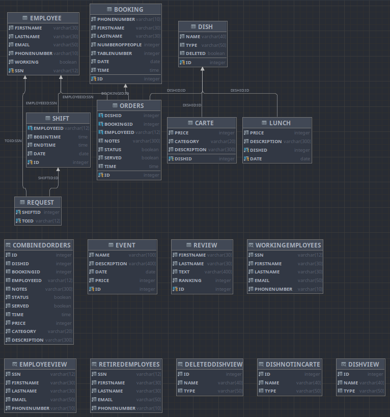
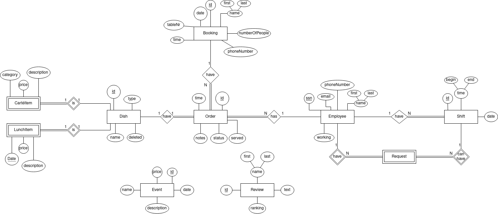

# Antons Skafferi Database

REST backend for the "Antons Skafferi" restaurant system. Built with Jakarta EE (JAX-RS) on Payara Server 6 and an embedded Apache Derby database. JPA entities map to the Derby schema. The service exposes a JSON API only; no UI pages are bundled.

## Clients
The API serves four clients:
- [`antons-skafferi`](https://github.com/deadlica/antons-skafferi) — JSF web frontend (public site + admin)
- [Schedule app](https://github.com/angelicaengstrom/dt142-scheduleapp) — Android app for employees to view their shifts
- [Waiter app](https://github.com/miun-jvig/DT142G.Projekt.Servitor) — Android app for waiters to take and deliver orders
- [Kitchen app](https://github.com/miun-jvig/DT142G.Projekt.Kok) — Android app for chefs to receive orders and mark them done

## What it does
Exposes REST endpoints for everything the restaurant runs on: staff, their shifts, table bookings, lunch and dinner menus, dishes, orders, events, and customer reviews. Writes go through validation so the clients can't corrupt the data (invalid dates, duplicate shifts, malformed personnummer etc. are rejected).

Event images are stored on the filesystem. Derby data is seeded from `AntonsSkafferiDB.zip` on first start, so a fresh deploy comes up with usable sample data.

## Endpoints
See the frontend's [`api-docs/index.xhtml`](https://github.com/Deadlica/antons-skafferi/blob/master/src/main/webapp/api-docs/index.xhtml) for the current reference, and [`samples.html`](https://github.com/Deadlica/antons-skafferi/blob/master/src/main/webapp/api-docs/samples.html) for example payloads. When the frontend is running, the same pages are served at `/api-docs/`.

---

# Running

The easiest path is Docker. For IDE-based development, see "Development" below.

## Option A: Pull the prebuilt image

```bash
docker run -d --name antons-skafferi-db \
  -p 8080:8080 \
  -v skafferi-derby:/var/skafferi/derby \
  -v skafferi-images:/var/skafferi/event-images \
  deadlica/antons-skafferi-db:latest
```

Verify:
```bash
curl http://localhost:8080/antons-skafferi-db/api/employee
```

## Option B: Build from source

```bash
git clone https://github.com/deadlica/antons-skafferi-db.git
cd antons-skafferi-db
docker build -t antons-skafferi-db .
docker run -d --name antons-skafferi-db \
  -p 8080:8080 \
  -v skafferi-derby:/var/skafferi/derby \
  -v skafferi-images:/var/skafferi/event-images \
  antons-skafferi-db
```

On first start the container:
1. Unpacks `AntonsSkafferiDB.zip` into the `derby` volume.
2. Applies views via `init-views.sql`.
3. Registers the `__derby` JDBC resource via `post-boot-commands.asadmin`.
4. Deploys the WAR and starts serving on port 8080.

## Configuration

Environment variables:

| Variable | Default | Purpose |
|---|---|---|
| `EVENT_IMAGE_DIR` | `/var/skafferi/event-images` | Host directory for uploaded event images |

Volumes (in-container paths):
- `/var/skafferi/derby` — Derby database files (seeded on first boot)
- `/var/skafferi/event-images` — uploaded event images

## Resetting the database

```bash
docker stop antons-skafferi-db && docker rm antons-skafferi-db
docker volume rm skafferi-derby
# then re-run the run command
```

---

# Development

For iterating on code with a local JDK and IDE.

## Requirements
- JDK 17
- Maven 3.9+
- IntelliJ IDEA (or any Jakarta-aware IDE)
- Payara Server Full 6

## Build the WAR

```bash
./mvnw -DskipTests package
# produces target/antons-skafferi-db-1.0-SNAPSHOT.war
```

## Run with Docker (rebuild after code changes)

```bash
docker build -t antons-skafferi-db .
docker stop antons-skafferi-db 2>/dev/null; docker rm antons-skafferi-db 2>/dev/null
docker run -d --name antons-skafferi-db -p 8080:8080 \
  -v skafferi-derby:/var/skafferi/derby \
  -v skafferi-images:/var/skafferi/event-images \
  antons-skafferi-db
```

## Project layout
- `src/main/java/db/` — JPA entities
- `src/main/java/rest/entities/` — DTO/JPA entities used by the REST layer
- `src/main/java/rest/web/` — JAX-RS resources (`*Resource.java`) and business logic beans (`*Bean.java`)
- `src/main/webapp/` — WAR root
- `Dockerfile`, `start.sh`, `init-views.sql`, `post-boot-commands.asadmin` — image build + first-boot bootstrap

## Prebuilt images
Published on Docker Hub as `deadlica/antons-skafferi-db:latest` and `:v2`.

---

## UML diagram


## ER diagram

