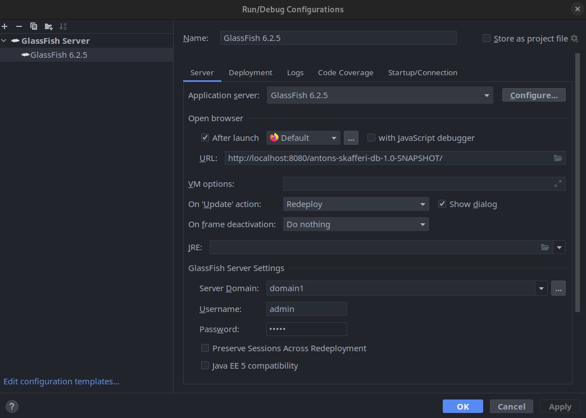

# Antons Skafferi Database
This is a server application for a restaurant built with the Jakarta framework with a local database connected to a derby pool which mapped to Java persistence units. The application also has a RESTful API which allows communications with the database. There is also a webpage with documentation for all the resources of the REST application. This server is used to fulfill requests for a webpage client, as well as 3 different androids apps. It handles the restaurants registrered employees, their shifts, as well as food menus, sales and bookings.

---

# Setup
## Requirements
* Jetbrains IntelliJ
* Eclipse GlassFish 6.2.5
* Jakarta EE 9.1 (Platform or Web Profile works)
* Java Development Kit 17.0.5
* Apache Derby drivers (can be installed through IntelliJ)
---
### Installing GlassFish 6.2.5
All that's required is to extract the files, by default there will be a domain called "domain1". To check that it's working, navigate to the bin folder and try starting the domain with "asadmin"
```bash
cd glassfish6/glassfish/bin
./asadmin start-domain domain1
```
Once glassfish has been successfully launched, go ahead and close it again.
```bash
./asadmin stop-domain domain1
```
---
### Setup configuration in IntelliJ
1. Open up the project in IntelliJ
2. Open up the "Select Run/Debug Configuration" dropdown menu in the top right corner, click "Edit Configurations...".
3. Click the "+" symbol in the top left corner, select GlassFish Server -> Local.
4. Select GlassFish 6.2.5 as the Application server by browsing to the installation folder.
5. Select domain1 as the Server Domain
6. Add the domains Username and Password. By default, Username is "admin" and there is no password.

Once done it should look something like this.



7. Next up, click the "Deployment" tab. Click the "+" then "Artifact..." and lastly "antons-skafferi-db:war"
8. If there are any other errors that shows up, clicking the "Fix" button should resolve it.
---
### Setup connection pool and connection resource
1. Go back to the terminal and navigate to the glassfish bin folder and start the domain.
```bash
./asadmin start-domain domain1 
```
2. open a web browser and enter the url "localhost:4848" (if you have added a password to domain1 you will be prompted to log in)
3. In "Common Tasks" to the left, navigate to Resources -> JDBC -> JDBC Connection Pools and click the button "New...".
4. Fill in any name in the "Pool Name" input
5. Select "javax.sql.DataSource" as the Resource Type and then click next
6. In the Datasource Classname input, enter "org.apache.derby.jdbc.ClientDataSource" in the input and click finish.
7. Go back to the pool that was just created by clicking on its name, click on the tab "Additional Properties"
8. Add the following properties:

The "PortNumber" value should be 1527 but to double-check it, in your terminal in the glassfish bin directory type:
```bash
./asadmin start-database
```
to see which port is used to host the database. Once the properties have been filled out press Save.
9. Next, head over to "JDBC Resources" and click "New..."
10. enter "__derby" as the JNDI Name, and select the Pool Name of the JDBC Connection Pool that was just created.
11. You can now close the glassfish admin page and stop the glassfish domain.
```bash
./asadmin stop-domain domain1
```
---
### Setup data source for the database in IntelliJ
1. Head on over to IntelliJ and click on View -> Tool Windows -> Database
2. There should be an item there called "db", right click it and select "properties".
3. Fill in the Username, Password fields, they should be the same ones that were added as properties in the connection pool (in this example its APP and APP).
4. Select how long to save the database credentials.
5. There should be a "missing driver files" warning at the bottom, click the Download button.
6. Click the "Test Connection" and it should respond with a "Succeeded" notification.
7. Turn off the database:
```bash
./asadmin stop-database
```
8. Extract "AntonsSkafferiDB.zip" that is found in the project folder. Navigate to glassfish6/glassfish/databases/ and replace the folder "AntonsSkafferiDB" with the one that was just extracted.
9. Turn on the database again:
```bash
./asadmin start-database
```
10. In the Database view in IntelliJ, right click on db and select "Refresh". All views and tables from the database should be visible now.
11. Start the server by running the glassfish configuration.

Everything should now be working :)

## UML Diagram


---

## ER Diagram


---
